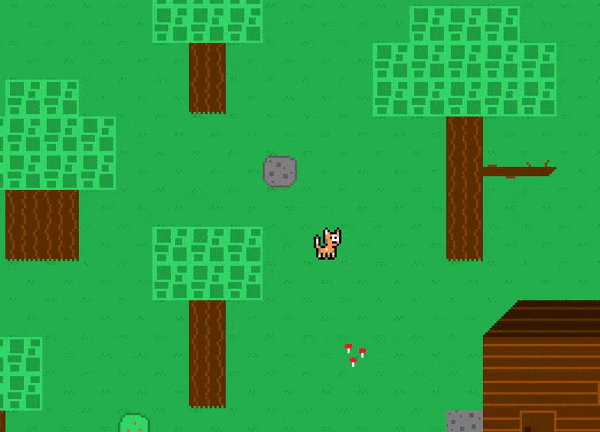
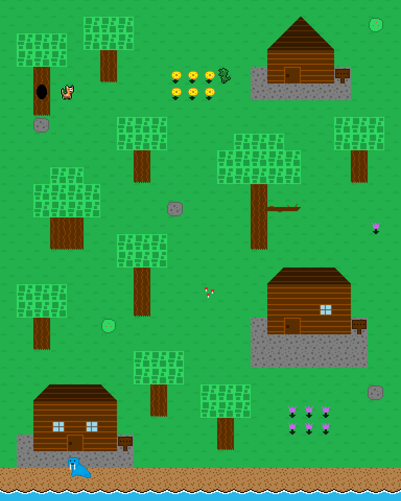
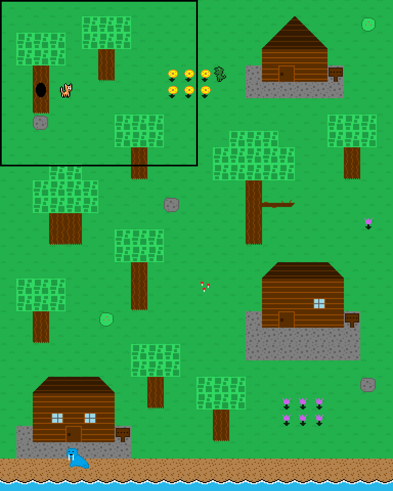

## Table of contents
{: .no_toc .text-delta }

1. TOC
{:toc}

---

# Map Camera

## What is the map camera?

The map camera, which is represented by the `Camera` class in the `Level` package, is the class responsible for keeping track of which section of a map needs to be shown/updated during a specific time period. 
If you have ever played a 3D video game, you will have an idea of what a game's map camera is -- often times you are given the ability in such games to rotate the camera at will to see different parts of the map as you play.
In a 2D game, the camera is a lot simpler, as there are only four movement directions -- up, down, left, and right.

Take a look at the below gif:

As the player moves across the map, it's the `Camera` class's job to change what pieces of the map are shown/updated. 
This is used to give the appearance that the map is "scrolling" as the player moves. 
In reality, once the player hits the half-way point on the screen (both x direction and y direction),
instead of the player moving forward, the camera actually moves to show more of the map.
When this is happening, you'll notice that the player doesn't leave the center of the screen. 
Once the player reaches an end of the map, and the camera has no more to scroll through, the camera just stays in place, and the player can move freely around the screen.

## How does camera movement work?

Think of the camera as a defined rectangle, with x, y, width, and height attributes. 
The width and height of the camera are set to the entire size of the screen.

Below is the entire map image, which is made up of individual tiles. The entire map does NOT fit on the screen all at once.

 
The camera starts at x and y (0, 0) when the map is first loaded. 
Upon starting the game, the camera moves to match where the player's start location is (the player is the cat). 
The screen size is around 800x600, so you can think of the camera as the black rectangle on the below image of the map. 
The rectangle shows that only a piece of the entire map is being shown on the screen at any given time:

As the player moves throughout the map, the camera follows it to show different pieces of the map.

## Active Map Resources

The camera is also responsible for determining which map tiles, NPCs, enhanced map tiles, and triggers
are a part of the current area of the map that is being shown, meaning those entities need to be a part of the `update` and `draw` cycle. 
In order to not waste computing resources, the camera is constantly checking if a map entity is not in the "active" area (such as an NPC that is too far outside of the camera's bounds).
This is important as wasting time updating and drawing items that do not affect the player can negatively affect FPS and cause the game to slow down.

Map entities that are to be included in the `update` and `draw` cycle at any given time are considered "active".
The `Map` class exposes three methods for `getActiveNPCs`, `getActiveEnhancedMapTiles` and `getActiveTriggers` for other classes to use. 
These methods contain a subsection of each map entity resource that is currently active. This is useful for certain pieces of the game logic, such as collision detection -- instead of having to check against every entity in the game, only a subsection of the entities will be checked against, which saves time and computing resources. 
Looking at the above images of the camera example on the entire map image, it's more apparent how only certain NPCs that are in the camera's range need to be included in the `update` and `draw` cycles at any given time. 
If you look at the first image, there's no reason to update the walrus NPC during that time, as it is far off-screen that the player won't even see it until they move a bit.

The variable `UPDATE_OFF_SCREEN_RANGE` determines the "tile range" threshold that a map resource can be off-screen until it is considered inactive.
It is currently set to 4, so if any map resource is more than 5 tiles away off-screen, it will be removed from the game cycle until it comes back into range.
Entities also have an `isUpdateOffScreen` instance variable that when toggled on will keep the entity in the update cycle regardless of where it is on the map.
While this game currently does not make use of this, there are certainly future enhancements where this toggle can come in handy.

The `Camera` class's `loadActiveNPCs`, `loadActiveEnhancedMapTiles`, and `loadActiveTriggers` methods are called each game loop cycle (each frame)
to determine which map entities are currently active and which ones are not.